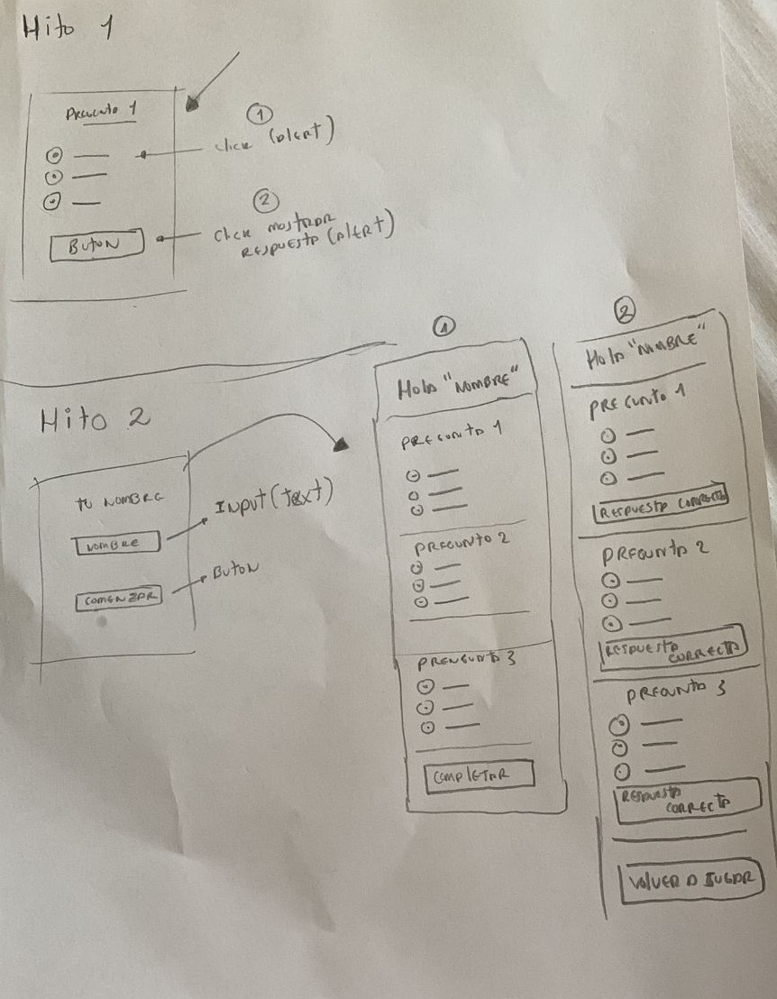
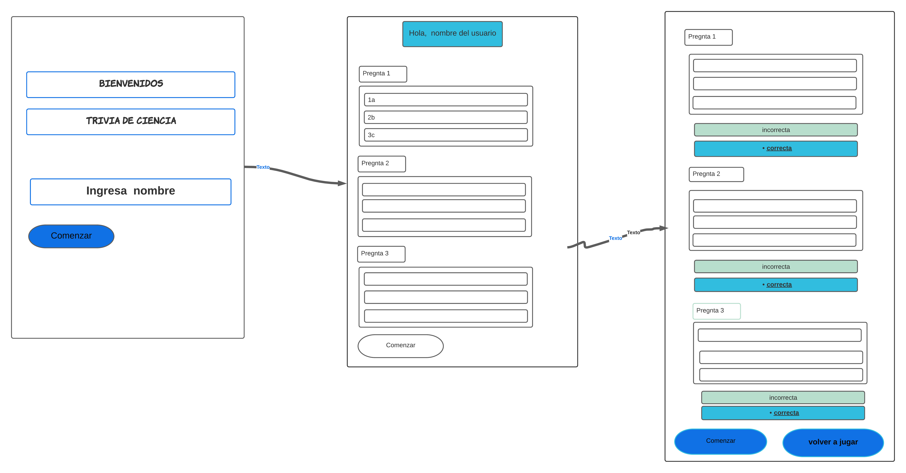

# Proyecto TRIVIA
## ¿Cuál fue nuestro proceso y cómo resolvimos la necesidad de la usuaria?

#### Bosquejo

El día 1 inició despues de una explicación detenida del proyecto y con ello la angustia por el tiempo, pero habría que iniciar el proyecto pronto y con ello primero debíamos dibujar a mano alzada un Mockup de lo que ibamos a hacer y considerar todas las necesidades de nuestra usuaria.

#### Mapa de procesos

Ya llegaba la noche y todo indicaba que prontamente nuestras energías acabarian por dejarnos dormidas sin embargo alcanzamos a finalmente terminar nuestro mapa de procesos en Lucid.

#### Investigación

La mayor parte de los días estuvimos leyendo información que aumentaban el entendimiento en algunos puntos del proyecto como ver que etiquetas a implementar en el HTML; luego, investigamos pasamos a ver código JAVASCRIPT para afrontar los retos del proyecto y finalmente queriamos demostrar y pulir partes la interfaz agregando un diseño amigable con CSS3. Ya solo quedaba esperar a nuestro Q&A para desenmarañar el enredo que teniamos.

#### Programación

Una semana super intensa pero no lo cambiaríamos por nada, nos probamos que podíamos y aunque el código era extenso y probablemente a futuro logremos refactorizar el código que resumirían todas nuestras líneas en unas cuantas, estabamos super orgullosas de lo logrado.

Aqui aprendimos en HTML
- link: (Sirve para llamar estilos)
- section: (Sirve para separar bloque de código y dividirlas en secciones)
- form: (Sirve para hacer)
- input: (Lo usamos para poner campos tipo text y radio)
- button: (Sirve para colocar botones)
- label: (Lo usamos para acompañar a los imput y mostrar un título)

Aqui aprendimos en JAVASCRIPT
- document.getElementById ()
- style.display
- innerHTML 

#### Publicación

## ¿Fuimos cambiando cosas en el camino? ¿cuáles? ¿Por qué?

Si,iniciamos con un bosquejo que reflejara lo que queriamos hacer en el camino nos dimos cuenta que no teniamos mucha base ni conocimientos y de alguna manera asi documentarnos primero que hacia html javasscript y css la de funcion de cada uno y asi porder ejecutar el proyecto en codigo en nuestra plataforma de Replit, nos documentamos sobre las varialbles, elementos y sus funciones. Y a medida que armabamos el codigo juntas fue ensayo y error y poco a poco lo fuimos estructurando con nuestro Q&A.

